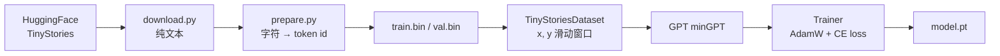

# PyTorch + minGPT + TinyStories 学习项目

面向学习的标准语言模型训练流程：模块清晰、注释完整，对应 Andrej Karpathy 的 [minGPT](https://github.com/karpathy/minGPT) 与 [TinyStories](https://arxiv.org/abs/2305.07759) 数据集。

## 项目结构

```
LLMTest/
├── mingpt/              # 教学用手写 GPT（源自 minGPT）
│   ├── model.py
│   ├── trainer.py
│   └── utils.py
├── models/              # 成熟库封装（与 mingpt 平行）
│   └── hf_gpt.py        # HuggingFace GPT2LMHeadModel + KV cache 生成
├── data/                # 下载 / 预处理 / Dataset（两版共用）
├── config/
│   ├── train_config.py      # minGPT 后端配置
│   └── train_config_hf.py   # HF 后端配置
├── train.py             # 手写 minGPT 训练
├── train_hf.py          # Transformers 训练（推荐对比学习）
├── sample.py / sample_hf.py
└── scripts/run_all.sh
```

## 双轨对比：手写 minGPT vs HuggingFace

| | `train.py` + `mingpt/` | `train_hf.py` + `models/hf_gpt.py` |
|--|------------------------|-------------------------------------|
| 模型 | 单文件手写 Transformer | `transformers.GPT2LMHeadModel` |
| 训练 | 全序列前向 | 全序列前向（`use_cache=False`） |
| 生成 | 手写 `generate` 循环 | `model.generate(use_cache=True)` **KV cache** |
| 目的 | 读懂每一行实现 | 工业界常用栈、性能与功能更全 |

数据与 `Trainer` 完全共用，只换模型类。

## 训练流程（概念）



1. **下载**：`karpathy/tinystories-gpt4-clean` 中的英文小故事。
2. **预处理**：字符级词表（约 70+ 个 ASCII 字符），按 9:1 划分 train/val。
3. **Dataset**：每个样本长度 `block_size`，`y` 是 `x` 右移一位（next-token prediction）。
4. **模型**：Decoder-only GPT（`gpt-nano` 约 30 万参数，适合入门）。
5. **训练**：交叉熵损失、梯度裁剪、周期性验证与文本采样。

## 快速开始

```bash
cd LLMTest
python -m venv .venv
source .venv/bin/activate   # Windows: .venv\Scripts\activate
pip install -r requirements.txt

# 三步流水线
python -m data.download --max_stories 50000
python -m data.prepare
python train.py          # 手写版
# 或
python train_hf.py       # HuggingFace 版（需 transformers）
```

或：

```bash
bash scripts/run_all.sh
```

训练完成后生成故事：

```bash
python sample.py --prompt="Once upon a time, there was a little girl named Emma."
python sample_hf.py --ckpt=./out/tinystories_hf/model.pt
```

## 常用命令行覆盖

```bash
# 更大模型、更长训练
python train.py --model.model_type=gpt-micro --trainer.max_iters=5000

# 更长上下文（显存占用增加）
python train.py --data.block_size=512 --trainer.batch_size=16
```

## 为何用字符级分词？

TinyStories 语料几乎全是 ASCII，字符级词表很小，小 GPT 更容易收敛，也便于理解「每个 token 就是一个字符」。minGPT 本身支持任意 `vocab_size`；若要用 GPT-2 BPE（50257 词表），可替换 `prepare.py` 中的分词逻辑，并相应增大 `model_type`。

## 参考

- [minGPT](https://github.com/karpathy/minGPT)
- [TinyStories 论文](https://arxiv.org/abs/2305.07759)
- [tinystories-gpt4-clean 数据集](https://huggingface.co/datasets/karpathy/tinystories-gpt4-clean)
